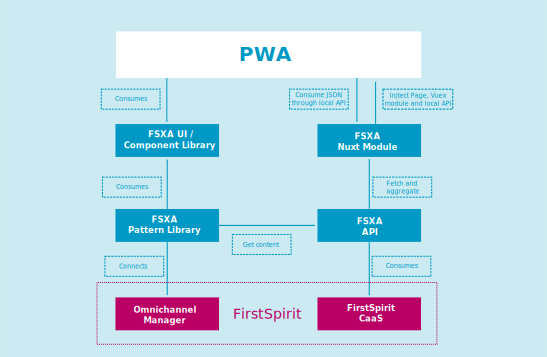

[README](../README.md) » Introduction

# Introduction

## General

The FSXA PWA is a project that demonstrates how to build a *Progressive Web App* that is consuming contents created and continuosly updated with the enterprise content management system [FirstSpirit](https://www.e-spirit.com/en/product/firstspirit-dxp/enterprise-cms/). It is part of the [FirstSpirit Experience Accelerator](https://docs.e-spirit.com/module/fsxa/), a set of projects allowing you to set up a state-of-the-art web presence in a fraction of the time required previously or with competing products.

## Projects used

The FSXA PWA connects to several other projects:

* [FSXA-UI](https://github.com/e-Spirit/fsxa-ui)/ Component Library
* [FSXA-Pattern-Library](https://github.com/e-Spirit/fsxa-pattern-library)
* [FSXA-API](https://github.com/e-Spirit/fsxa-api)
* [FSXA-Nuxt-Module](https://github.com/e-Spirit/fsxa-nuxt-module)
* [Omnichannel Manager](http://docs.e-spirit.com/tpp/)
* [FirstSpirit CaaS](https://docs.e-spirit.com/module/caas/CaaS_Platform_Documentation_EN.html)

The role of each of these is best seen in the architecture layout depicted below:

## Architecture

### Omnichannel Manager

The Omnichannel Manager provides the FirstSpirit ContentCreator's advanced editing and workflow capabilities to your PWA.

### FirstSpirit CaaS

The [FirstSpirit CaaS](https://docs.e-spirit.com/module/caas/CaaS_Platform_Documentation_EN.html) (Content as a Service) provides all editorial content from your FirstSpirit project. Your project's structural data is provided as well, via the [Navigation Service](https://docs.e-spirit.com/module/caas/CaaS_Platform_Documentation_EN.html).

### FSXA UI / Component Library

FSXA UI is a component library used by the FSXA PWA. It contains all components used in the sample project. The Component Library is maintained and continuously extended by the e-Spirit AG.

### FSXA Pattern Library

The FSXA Pattern Library manages the connection to the “outside world”. This means it handles the data coming from the CaaS (the FSXA-API acting as an intermediate stage) and provides this data to the PWA. It also connects the PWA to the Omnichannel-Manager to have components editable in the FirstSpirit ContentCreator.

### FSXA API

In headless environments, the editorial content from FirstSpirit is provided via the CaaS. Additionally, the site's structure can be accessed via the Navigation Service (here considered part of the CaaS).

To make using these two services as easy as possible, we have developed the FSXA API. This project already provides a rich API to communicate with both services in a standardized way. It also transforms the responses of the CaaS and the Navigation Service and enriches them with other useful data.

For example, it converts the Navigation Service tree structure into easy to use maps and also extracts the start page directly.

The responses of the CaaS are transformed as well and unnecessary information for the frontend is removed.

### FSXA NUXT Module

The FSXA Nuxt Module integrates the FSXA Pattern Library on a Node.js server. This Node.js server with NUXT is used for Server Side Rendering.

## Deployment

By default customers are provided with a DQP setup: Development, Quality Assurance, and Production. There are *git* repositories and server setups for each stage. In the FSXA default setup all that is required to deploy changes to a PWA is pushing changes to the respective repository. The PWA will automatically be built and deployed.

Technology used "behind the scenes":

* [Kubernetes](https://kubernetes.io/)
* [Helm](https://helm.sh/)
* [Rancher](https://rancher.com/)

